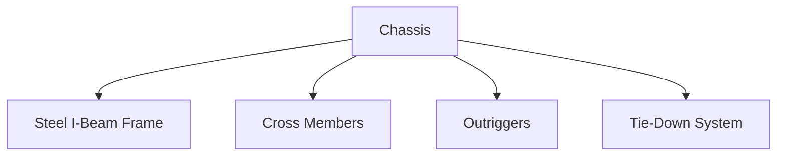

# 🏠 Rapid Deployment Housing Module

Our Rapid Deployment Housing Module is a state-of-the-art solution designed for quick installation and maximum efficiency. Built to HUD code specifications, this dual-module unit provides comfortable living spaces with modern amenities and energy-efficient features.

## 📊 Quick Specifications

| Feature | Value |
|---------|-------|
| Total Living Area | 619 SF |
| Configuration | Two Connected Modules |
| Dimensions | 26'-6" × 11'-8" per unit |
| Deployment Time | 7-10 Days |
| Bathrooms | 4 Full Sets |
| Kitchens | 2 Complete Units |

## 🚀 Key Features

<b>Quick Deployment</b>

- ✅ Factory-built chassis system
- ✅ No concrete foundation needed
- ✅ Pre-assembled components
- ✅ Quick-connect utilities
- ✅ Same-day weather protection

<b>Quality Construction</b>

- ✅ Steel frame construction
- ✅ Energy-efficient design
- ✅ Complete thermal envelope
- ✅ Premium materials
- ✅ Factory quality control

## 🏗️ Construction Details

### Structural System

### Energy Efficiency
- High-performance insulation (R-19 Floor, R-13 Walls, R-30 Roof)
- Energy Star certified appliances
- LED lighting throughout
- Low-flow water fixtures
- HVAC heat pump system (SEER 14+)

## 💫 Premium Features

### Kitchen Package
- Full appliance set (Energy Star rated)
- Custom wood cabinetry
- Laminate countertops
- Stainless steel sink
- LED lighting package

### Bathroom Package
- One-piece fiberglass units
- Water-efficient fixtures
- Ceramic tile flooring
- Wood vanity with storage
- Chrome accessory package

### Interior Finishes
- Commercial grade LVP flooring
- Semi-gloss wall finish
- Window coverings included
- Modern lighting package
- Quality door hardware

## 📋 Technical Specifications

<b>Structural Details</b>

| Component | Specification |
|-----------|---------------|
| Main Frame | 12" I-Beam Steel |
| Floor System | 2×6 Joists @ 16" O.C. |
| Wall Construction | 2×4 @ 16" O.C. |
| Roof System | Engineered Trusses @ 24" O.C. |
| Design Wind Load | 90 mph |

<b>Mechanical Systems</b>

| System | Specification |
|--------|---------------|
| Electrical | 200 AMP Service |
| HVAC | 2-Ton Heat Pump |
| Water Heater | 40 Gallon Electric |
| Plumbing | PEX Distribution |

## ⏱️ Installation Process

## 🛡️ Warranty Coverage

| Type | Duration |
|------|----------|
| Comprehensive | 1 Year |
| Structural | 5 Years |
| Major Systems | 10 Years |
| Support | Lifetime |

## 📞 Contact Information

Ready to learn more about our Rapid Deployment Housing Module? Contact our team:

- 📧 [Email Us](mailto:info@company.com)
- 🌐 [Visit Website](https://company.com)
- 📞 [Call Now](tel:+1234567890)

---

*For detailed specifications, pricing, and customization options, please contact our sales team.* 