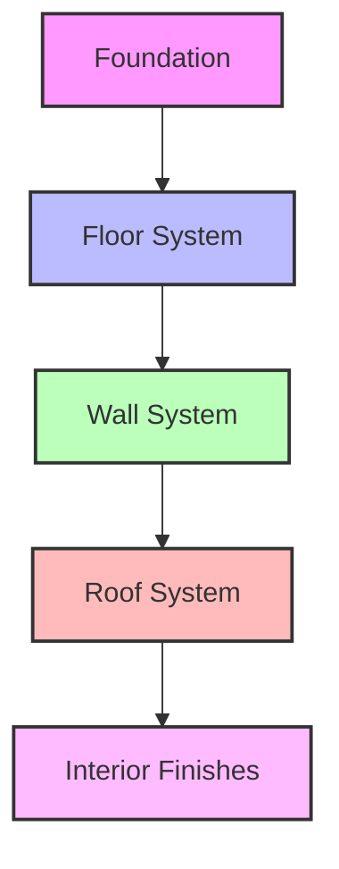

# Core+ Rapid Deployment Housing Module - Technical Specifications

## Overview
This document provides detailed technical specifications for the Core+ Rapid Deployment Housing Module, designed to meet HUD code requirements and industry standards.

## Structural System

### Foundation Requirements
- Minimum 4" concrete slab
- 12" x 12" footings at corners
- 6" x 6" perimeter beam
- Vapor barrier required
- Anchoring system: 1/2" diameter anchor bolts

### Floor System
- 2x6 steel joists at 16" O.C.
- 3/4" plywood subfloor
- R-19 insulation
- Vapor barrier
- Underlayment for finished flooring

### Wall System
- 2x4 steel studs at 16" O.C.
- 5/8" OSB sheathing
- R-21 insulation
- Vapor barrier
- Interior drywall

### Roof System
- 2x6 steel trusses at 24" O.C.
- 5/8" OSB decking
- R-38 insulation
- Asphalt shingles (30-year warranty)
- Ice and water shield

## Mechanical Systems

### Electrical
- 200-amp service panel
- GFCI outlets in wet areas
- LED lighting package
- Smoke detectors
- Carbon monoxide detectors

### Plumbing
- PEX water supply lines
- ABS waste lines
- Water heater (40-gallon)
- Fixture rough-ins

### HVAC
- 2-ton heat pump
- Ducted system
- Programmable thermostat
- MERV 8 air filters

## Materials Specifications

### Exterior Finishes
- Vinyl siding (0.042" thickness)
- Aluminum soffit and fascia
- Composite decking
- Energy-efficient windows

### Interior Finishes
- 5/8" drywall
- Premium vinyl flooring
- Ceramic tile in wet areas
- Solid core doors

## Performance Standards

### Energy Efficiency
- R-21 wall insulation
- R-38 ceiling insulation
- Energy Star appliances
- Low-E windows

### Sound Transmission
- STC 45 between rooms
- STC 50 exterior walls
- IIC 45 floor/ceiling

### Fire Resistance
- 1-hour fire rating
- Fire-rated doors
- Smoke detectors
- Fire extinguisher

## Quality Control

### Testing Requirements
- Wind load testing (120 mph)
- Snow load testing (40 psf)
- Seismic testing
- Water penetration testing

### Inspection Points
- Foundation preparation
- Module placement
- Mechanical systems
- Final inspection

## Installation Requirements

### Site Preparation
- Level building pad
- Proper drainage
- Utility connections
- Access road

### Equipment Needed
- Crane (minimum 30-ton)
- Forklift
- Power tools
- Hand tools

### Crew Requirements
- 4-6 experienced installers
- Crane operator
- Electrician
- Plumber

## Documentation

### Required Permits
- Building permit
- Electrical permit
- Plumbing permit
- Mechanical permit

### Certifications
- HUD certification
- Energy Star certification
- ICC certification
- Local building code compliance

## Maintenance

### Regular Maintenance
- HVAC filter replacement
- Gutter cleaning
- Exterior inspection
- Interior inspection

### Warranty Coverage
- Structural: 50 years
- Materials: 30 years
- Workmanship: 10 years
- Mechanical systems: 5 years

## Contact Information
For technical support or questions:
- Technical Support: (555) 123-4567
- Email: technical@coreplus.com
- Emergency: (555) 987-6543 