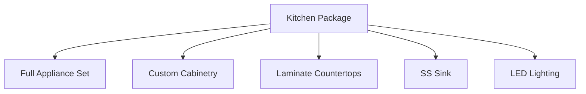
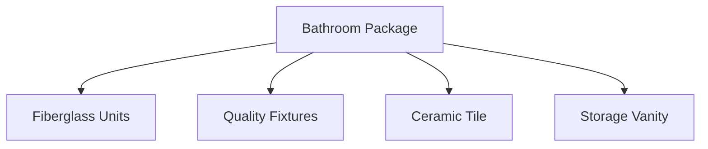
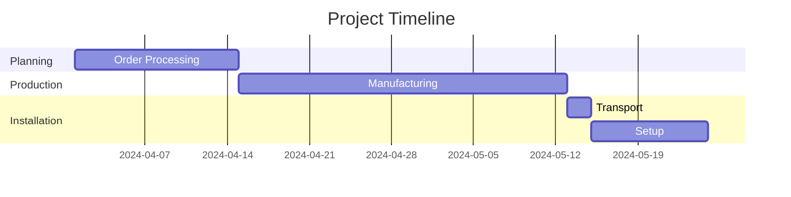

# 🏠 Rapid Deployment Housing Solution
## 📋 Project Proposal

Dear Valued Client,

Thank you for considering our rapid deployment housing solution. We are pleased to present this proposal for a high-quality, HUD-certified modular housing unit designed for quick deployment and maximum efficiency.

## 📊 Project Overview

| Feature | Specification |
|---------|---------------|
| Type | Dual-Module Housing Unit |
| Living Space | 619 Square Feet |
| Configuration | Two Connected Modules |
| Deployment | 7-10 Days from Delivery |
| Certification | Full HUD Code Compliance |

## ⭐ Key Features & Benefits

<b>🚀 Rapid Deployment</b>

- ✅ Factory-built chassis system
- ✅ No concrete foundation needed
- ✅ Pre-assembled components
- ✅ Quick-connect utilities
- ✅ Same-day weather protection

<b>🏗️ Quality Construction</b>

- ✅ Steel frame construction
- ✅ Energy-efficient design
- ✅ Complete thermal envelope
- ✅ Premium materials
- ✅ Factory quality control

<b>🏠 Complete Living Solution</b>

- ✅ Two efficient living units
- ✅ Four full bathrooms
- ✅ Two complete kitchens
- ✅ Energy Star appliances
- ✅ Modern finishes

<b>💡 Energy Efficiency</b>

- ✅ High-performance insulation
- ✅ Energy-efficient windows
- ✅ LED lighting throughout
- ✅ HVAC heat pump system
- ✅ Low-flow water fixtures

## 🎯 Included Amenities

### 🍳 Kitchen (Per Unit)

### 🚿 Bathrooms

### 🏠 Interior Features
- ✨ Luxury vinyl plank flooring
- 🎨 Semi-gloss wall finish
- 🪟 Window coverings
- 💡 Modern lighting package
- 🔑 Quality door hardware

## 💰 Project Investment

### Total Project Cost: $102,631

| Component | Cost |
|-----------|------|
| Materials & Components | $76,004 |
| Labor & Installation | $19,727 |
| Permits & Certifications | $6,900 |

### 📅 Payment Schedule

| Stage | Percentage | Amount |
|-------|------------|--------|
| Deposit | 25% | $25,658 |
| Frame Completion | 25% | $25,658 |
| Interior Completion | 40% | $41,052 |
| Final Completion | 10% | $10,263 |

## ⏱️ Timeline

| Phase | Duration |
|-------|----------|
| Order Processing | 1-2 weeks |
| Manufacturing | 3-4 weeks |
| Transportation | 1-2 days |
| Installation | 7-10 days |

### 📋 Installation Schedule
1. **Days 1-2:** Set and level
2. **Days 3-4:** Utility connections
3. **Days 5-7:** Interior finish
4. **Days 8-10:** Final details and inspection

## 🛡️ Warranty & Support

| Coverage | Duration |
|----------|----------|
| Comprehensive | 1 Year |
| Structural | 5 Years |
| Major Systems | 10 Years |
| Support | Lifetime |
| Service Network | Local |

## 📝 Required for Installation

- 📏 Level site within 12" grade
- 🔌 Utility connections within 20'
- 🚛 Access for delivery equipment
- 📋 Local permits (we handle)
- 🔒 Site security during install

## 📈 Next Steps

1. 📋 Proposal Review & Acceptance
2. 🏗️ Site Evaluation
3. ✍️ Contract Signing & Deposit
4. 📅 Production Scheduling
5. 🚚 Delivery Coordination

## ⭐ Optional Add-Ons

| Enhancement | Description |
|-------------|-------------|
| Extended Warranty | Additional coverage |
| Premium Appliances | Upgraded package |
| Solar Ready | Green energy prep |
| Smart Home | Home automation |
| Enhanced Exterior | Premium finishes |

## 📜 Terms & Conditions

- ⏰ Proposal valid for 30 days
- 🏗️ Subject to site inspection
- 🌤️ Weather considerations
- 📋 Local code compliance
- 🔒 Standard insurance requirements

---

We appreciate the opportunity to provide this housing solution and look forward to exceeding your expectations. Please contact us with any questions or to proceed with the project.

Best regards,

**[Company Name]**  
📞 [Phone]  
📧 [Email]  
🌐 [Website]  

---
*All specifications and pricing are subject to final contract terms and conditions.* 