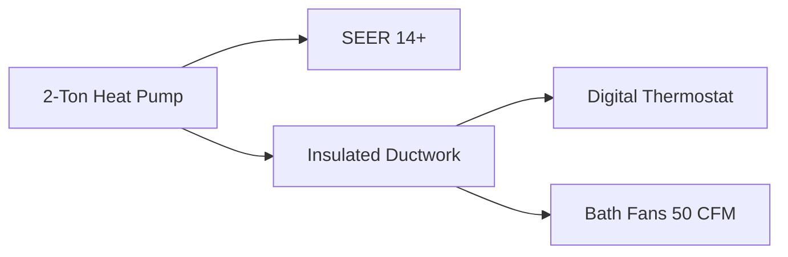
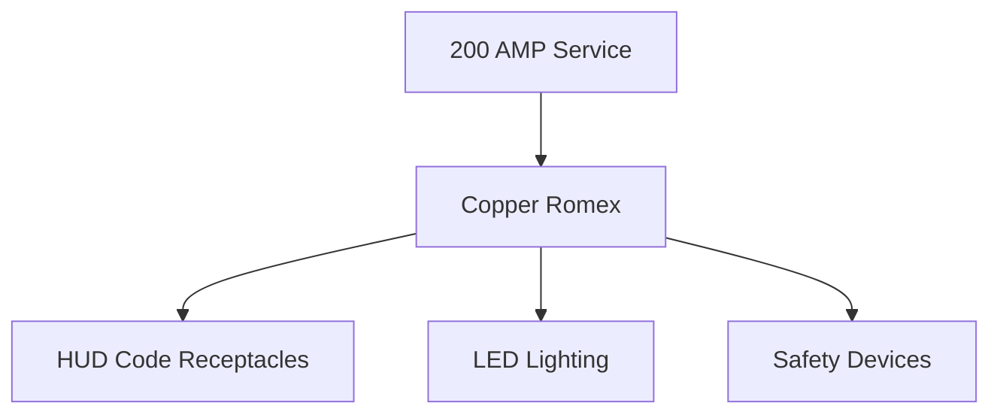

# 🏗️ Technical Specifications - Rapid Deployment Housing Module

## 📊 General Specifications

| Specification | Value |
|--------------|-------|
| Total Living Area | 619 SF (2 modules @ 309.26 SF each) |
| Module Dimensions | 26'-6" × 11'-8" per unit |
| Ceiling Height | 8'-0" |
| Construction Type | HUD Code Manufactured Housing |
| Design Wind Load | 90 mph |
| Thermal Zone | 2-3 |
| Energy Compliance | HUD Thermal Zone II |

## 🏗️ Structural System

<b>🔧 Chassis System</b>

- **Main Rails:** 12" I-Beam Steel Frame
- **Cross Members:** 4" Steel Tube @ 16" O.C.
- **Outriggers:** Welded Steel Construction
- **Transport:** Removable Tandem Axles
- **Anchoring:** HUD Compliant Tie-Down System

<b>🏠 Floor System</b>

| Component | Specification |
|-----------|---------------|
| Joists | 2×6 @ 16" O.C. |
| Decking | 3/4" T&G Structural Panel |
| Insulation | R-19 Fiberglass |
| Vapor Barrier | Industrial Grade Bottom Board |
| Load Capacity | 40 PSF Live Load |

<b>🧱 Wall System</b>

| Component | Specification |
|-----------|---------------|
| Exterior Walls | 2×4 @ 16" O.C. |
| Interior Walls | 2×4 @ 16" O.C. |
| Insulation | R-13 Fiberglass |
| Sheathing | 7/16" OSB |
| Siding | Vinyl, .042" Thickness |
| Interior | 1/2" Drywall |

<b>🏠 Roof System</b>

| Component | Specification |
|-----------|---------------|
| Construction | Engineered Trusses @ 24" O.C. |
| Pitch | 4/12 |
| Sheathing | 5/8" OSB |
| Insulation | R-30 Blown Fiberglass |
| Roofing | 30-Year Architectural Shingles |
| Load Capacity | 20 PSF Live Load |

## 🔧 Mechanical Systems

### ❄️ HVAC

### 🚰 Plumbing
- **Water Distribution:** PEX System
- **Drainage:** PVC Schedule 40
- **Water Heater:** 40 Gallon Electric
- **Fixtures:** Low-Flow WaterSense
- **Bathrooms:** 4 Complete Sets

### ⚡ Electrical

## 🎨 Interior Finishes

### Flooring
- 🏠 **Living Areas:** Commercial Grade LVP
- 🚿 **Bathrooms:** Ceramic Tile
- 💧 **Water Protection:** 100% Waterproof

### Walls & Ceilings
- 🎨 **Finish:** Orange Peel Texture
- 🖌️ **Paint:** Low-VOC Semi-Gloss
- 📏 **Trim:** 2-1/4" Colonial Base
- 🪟 **Windows:** Pre-Finished Trim

### 🍳 Kitchens (2 Units)
- Custom Wood Cabinets
- Post-Form Laminate Counters
- Energy Star Appliances
- Double Bowl SS Sink

### 🚿 Bathrooms (4 Units)
- One-Piece Fiberglass Units
- Wood Vanity with Top
- Water-Efficient Fixtures
- Chrome Package

## 💡 Energy Efficiency

| Metric | Value |
|--------|--------|
| Overall U-Factor | ≤ 0.084 |
| Window U-Factor | ≤ 0.50 |
| SHGC | ≤ 0.25 |
| Air Infiltration | Per HUD Standards |
| Appliances | Energy Star Certified |

## 📋 Certifications & Compliance
- ✅ HUD Code Certified
- ✅ State Approved Plans
- ✅ Energy Star Qualified
- ✅ Third-Party Inspected

---
*For detailed drawings and specifications, please refer to the complete documentation package.* 